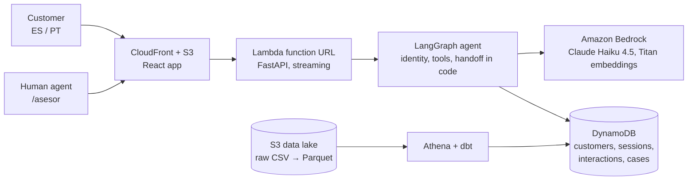

# Nova: first-contact resolution for a bank's contact center

**Nova resolves declined-payment and complaint questions on the first contact, with the customer's
own data, and when it can't, hands the case to a person with the verified facts, the evidence and a
faithfulness check, so the customer repeats nothing.**

Factored AI & Data Hackathon 2026 · AI-first banking agent · Spanish and Portuguese.

| | |
|---|---|
| **Live demo** | https://d2k8cgrqduyk2o.cloudfront.net |
| Customer login | open **"Modo demo: clientes de prueba"** on the login page; password `Nova2026`, the SMS code is shown on screen |
| Human agent console | [`/asesor`](https://d2k8cgrqduyk2o.cloudfront.net/asesor), key `Asesor2026` (shown in the field) |
| How the models are measured | [`/modelos`](https://d2k8cgrqduyk2o.cloudfront.net/modelos), password `Modelos2026` (shown in the field) |
| Full demo guide | [docs/demo.md](docs/demo.md) |

All customers are the challenge's **synthetic** dataset; no real person's data is used anywhere.

## The problem, in the bank's own data

In the LATAM Bank dataset (686k contact-center interactions), the reason for contact is the one thing
that moves first contact resolution (FCR). Channel, agent experience and sentiment do not:

| Reason | Interactions | Resolved on the first contact |
|---|---|---|
| Transactional | 240,056 | 90.6% |
| Product | 150,863 | 89.1% |
| Technical | 102,899 | 69.6% |
| Commercial | 54,879 | 65.0% |
| Retention | 20,578 | 60.0% |
| **Complaint** | 117,021 | **43.4%** |

The analysis behind it, including what did *not* move FCR, is in [docs/data-findings.md](docs/data-findings.md).

**Who has it:** the customer who writes in about a declined payment, a charge they don't recognize or
a complaint, and the human agent who receives the case and has to start over.

## What Nova does (3-minute demo path)

1. **Log in** as the demo customer *"Pago rechazado"* (a payment declined in the last month).
2. Ask *"¿Por qué me rechazaron una compra?"*. Nova reads **that customer's** transactions and
   answers with the merchant, the amount and the reason from the data (e.g. code 51, insufficient
   funds). No verification again: the login already proved who they are.
3. Say *"No reconozco este cargo"*. Fraud and disputes go to a person at once: Nova opens a case and
   tells the customer its number.
4. Open **`/asesor`**. The case shows Nova's summary and open questions, the **facts the system
   verified** (from the session, not from the model's words), the **account data Nova actually
   read**, and how **faithful** each answer was to that data. The agent replies in the same chat.
5. Switch the chat to Portuguese (*"Qual é o saldo das minhas contas?"*): same agent, same rules.

## What is different

**Core**
- **Permissions in code, not in the prompt.** Account tools take no customer id: the backend uses the
  verified session's. Identity verification (login with SMS code, or document + date of birth + code
  in the chat) runs outside the model. Every tool call goes to an audit trail.
- **A handoff built by code.** The case for the person carries verified facts and the evidence of the
  tools that ran, so the model cannot invent them.
- **Faithfulness in the agent console.** Each amount, date or name in Nova's answers is marked as found
  (or not) in the data it consulted.
- **An evaluation that shows the bad first run.** See [Evidence](#evidence).

**Supporting**
- An **intent classifier** (TF-IDF + logistic regression, 0.3 ms, $0) flags complaints and retention
  requests, the reasons the bank rarely solves on the first contact, so Nova offers a person sooner.
- **Knowledge search** (hybrid BM25 + Titan embeddings) for policy questions, citing its source.
- A **public assistant** outside the login (branches and hours), sessions that survive a reload, and
  an incremental **data pipeline** (dbt on Athena) with a freshness policy.

## Evidence

Every number below is generated from files in this repo, never typed by hand.

| What | Result | Where |
|---|---|---|
| Held-out evaluation, first run (60 cases × 3, before any fix) | safe automated resolution **91.1%**, 0 unsafe outcomes in 180 runs | [evals/report/REPORT.md](evals/report/REPORT.md) |
| 13 repeated passes (before the decision 38 fix, see the report) | safe automated resolution **99.9%** (sd 0.3), **0 unsafe outcomes in 2,340 runs**, p50 1.6 s / p95 2.9 s | same |
| End to end against the live app | **31/32** answers right and safe, first token 0.9 s | same |
| Intent classifier vs keyword rules | macro-F1 **0.853** vs 0.618 (Claude zero-shot: 0.890, but 0.57 s and $0.25 per 1,000) | [ml/README.md](ml/README.md), `/modelos` |
| Does the classifier change behavior? (ablation in the real agent) | complaint and retention messages where a person was offered or a case opened: **95%** with it vs **73%** without | same |
| Knowledge search | recall@1 **87%**, recall@3 **97%**, MRR 0.93 (BM25 alone: 82%, 0.88) | [ml/rag/README.md](ml/rag/README.md), `/modelos` |
| Cost | **$0.0041 per conversation** (Claude Haiku 4.5 on Bedrock), 84% of it input tokens | `/modelos` |

The first run is the honest estimate: the later runs reuse the same cases after fixing what the first
one found (the report lists every finding and fix).

## Architecture

Serverless and scale-to-zero on purpose: the team pays for it. Production calls models only through
Bedrock; the public API is rate-limited per visitor. Infrastructure is Terraform
([infra/](infra/)); details in [docs/architecture.md](docs/architecture.md), every decision with its
reason in [docs/decisions.md](docs/decisions.md).

## How we work on GitHub

- Feature branches → pull request into `development`, with CI (backend, frontend and agent evals).
- Releases: a pull request `development` → `main`, merged with a merge commit; a check blocks any other
  branch into `main`. The release is **manual on purpose** (the release owner reviews what goes live),
  then deploy and a dated release tag (`vYYYY.MM.DD`) are automatic.
- Decisions are logged in [docs/decisions.md](docs/decisions.md); the team guide is in
  [CONTRIBUTING.md](CONTRIBUTING.md).

## Limitations

- **All data is synthetic.** Evaluation cases, classifier phrases and knowledge questions were written
  by the team (with Claude's help), after building the agent: they show it generalizes across styles we
  wrote, not to real traffic.
- The in-process report uses **two fixture customers**; the end-to-end passes use dataset customers, but
  on a small sample (the public API allows 30 messages per hour per visitor).
- **Portuguese**: the dataset has no Brazilian customers, so Portuguese is covered by the conversation
  and the phrases, not by Brazilian accounts.
- The bank's transcripts carry **no signal to train on** (42 distinct texts in 171k), so the classifier
  learns from team-written phrases and takes the FCR rates from the dataset.
- Abstention is the weak part of the knowledge search; the model reading the chunks does most of it.
- NovaBank's policies and figures are fictitious.

## Run it locally

See [docs/setup.md](docs/setup.md). In short: `uv sync`, then from `backend/`
`uv run uvicorn app.main:app --reload --reload-dir app`, and from `frontend/` `npm install && npm run dev`,
then open http://localhost:5173. Tests: `uv run pytest` (backend), `npm test` (frontend).

## Team

| | Role |
|---|---|
| [Paul Montero](https://github.com/lpaulmp) | Backend, platform, agent AI |
| [Esteban Quintero Gómez](https://github.com/Estebanquingo) | Architecture, backend, frontend |
| [Miguel Higorre](https://github.com/miguel-higorre-ch) | Coordination, QA and evaluation, frontend |
| Iris | Initial Kickoff data and ML |
